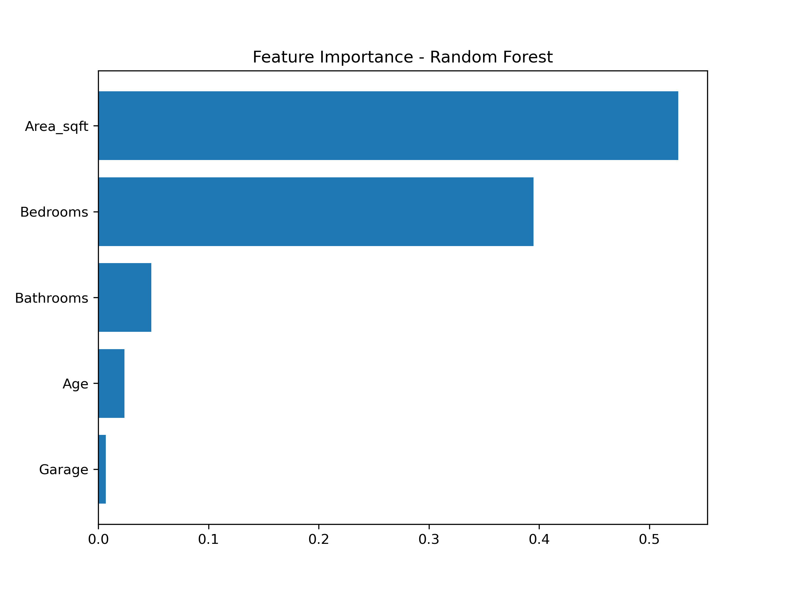
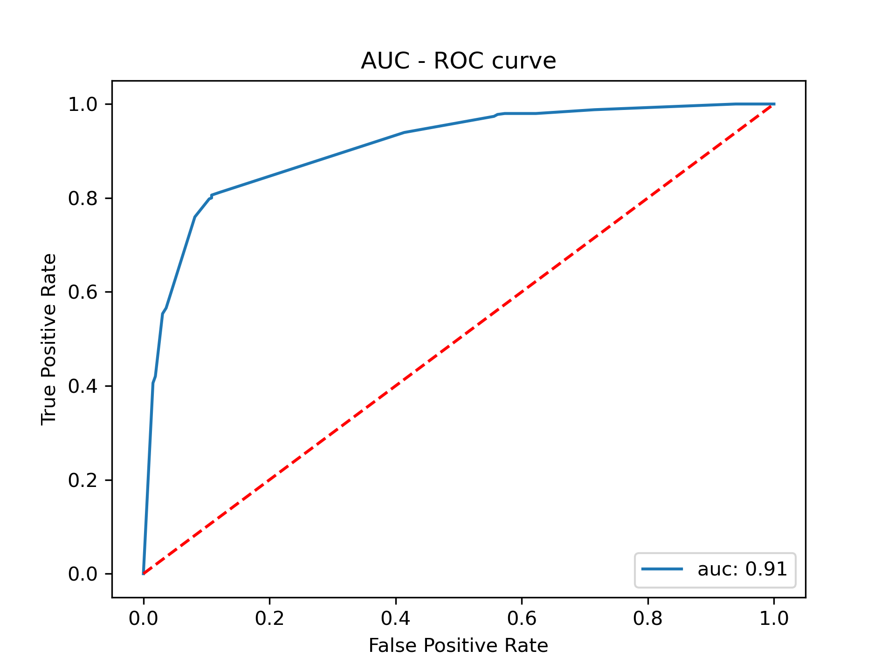
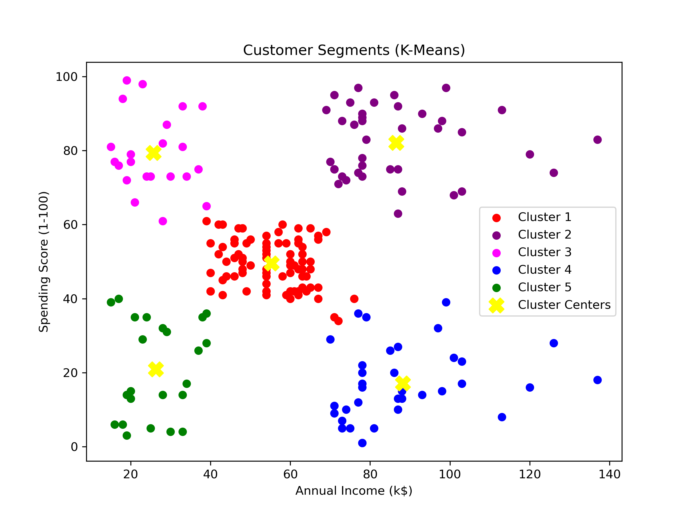

# Machine Learning Projects Portfolio


This repository contains **3 machine learning projects** demonstrating different ML tasks, including regression, classification, and clustering.

---

## Projects Overview

1. **Regression:** House Price Prediction using Linear Regression & Random Forest  
2. **Classification:** Customer Churn Prediction using Decision Trees & Random Forest  
3. **Clustering:** Customer Segmentation using K-Means  

---

## 1️⃣ Regression - House Price Prediction

**Objective:** Predict house prices based on features like bedrooms, bathrooms, area, age, and garage.  

**Models:**  
- Linear Regression  
- Random Forest Regressor  

**Dataset:** `house_.csv` (include rows × features)  

**Outputs:**  
- `model_evaluation.csv`  
- Scatter plot of predictions  
- Feature importance plot  

**Example Output:**  


**How to Run:**  
1. Open `Regression_HousePrice/house_prediction.ipynb`  
2. Ensure the dataset is in the same folder  
3. Run all cells to generate outputs

---

## 2️⃣ Classification - Customer Churn Prediction

**Objective:** Predict whether a customer will churn.  

**Models:**  
- Decision Tree  
- Random Forest  

**Dataset:** `Churn_preprocessed_data.csv`  

**Outputs:**  
- Confusion matrix  
- ROC-AUC curve  

**Example Output:**  


**How to Run:**  
1. Open `Classification_Churn/Classification_Decision_Tree.ipynb`  
2. Ensure the dataset is in the same folder  
3. Run all cells to generate outputs

---

## 3️⃣ Clustering - Customer Segmentation

**Objective:** Segment customers into clusters based on features.  

**Model:**  
- K-Means  

**Dataset:** `Mall_Customers.csv`  

**Outputs:**  
- Cluster plot  
- Silhouette score  
- Clustered dataset CSV  

**Example Output:**  


**How to Run:**  
1. Open `Clustering_KMeans/Customer_Segmentation_KMeans.ipynb`  
2. Ensure the dataset is in the same folder  
3. Run all cells to generate outputs

---

## Project Highlights

- Built **end-to-end ML pipelines** including preprocessing, modeling, and evaluation  
- Visualized model performance using **confusion matrices, ROC curves, scatter plots, and cluster plots**  
- Demonstrated **supervised learning** (regression & classification) and **unsupervised learning** (clustering)  
- Saved **outputs** for easy reproducibility

---

## How to Use

1. Clone the repository:  
```bash
git clone https://github.com/TarakNathKalia/ML_Projects.git
